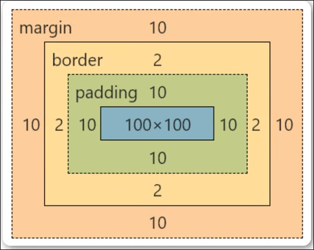

# CSS 盒子模型

## 概念

所有 HTML 元素可以看作盒子， 在 CSS 中, `box model` 这一术语是用来设计和布局时使用

CSS 盒模型本质上是一个合资， 封装周围的 HTML 元素, 包括

Margin, Border, Padding, Content

- Margin(外边距) - 清除边框外的内容， 外边框是透明的
- Border(边框) - 围绕在内外边框和内容外的边框
- Padding(内边距) - 清除内容周围的区域
- Content(内容) - 盒子的内容， 显示图像和文本
