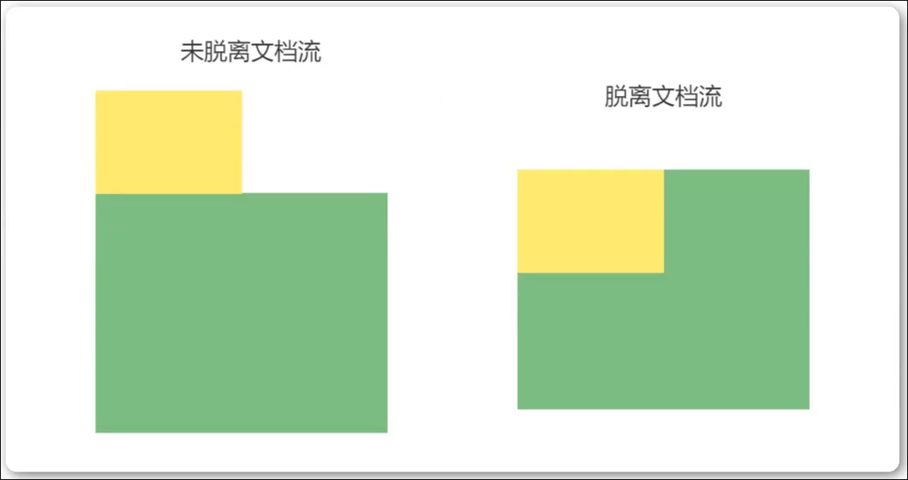

# 浮动

## 定义

`float` 属性定义元素在哪个方向浮动， 任何元素都可以浮动

- left - 元素向左浮动
- right - 元素向右浮动

> [!NOTE]
> 元素不支持向上或者向下浮动

- 浮动之后元素脱离的文档流

## 元素向左浮动

脱离文档流之后， 元素相当于在页面上面增加一个浮层来放置内容。 此时可以理解为有两层页面， 一层是底层的原页面， 另一层是脱离文档流的上层页面， 所以会出现折叠现象

