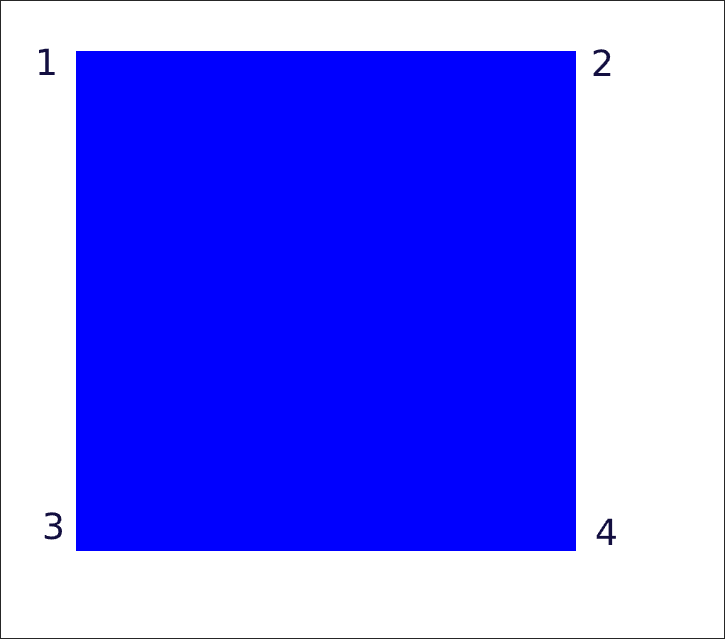

# CSS3 特性

## 圆角

使用 `border-radius` 属性， 可以给任何元素制作 圆角

为了方便展示我们使用编号来描述

`border-radius` 可以接收多个值:

有四种情况

参数使用 a b c d 表示，按照顺序
n 代表参数的个数

| 1 | 2 | 3 | 4 | n |
| -- | -- | -- | -- | -- |
| a | b | c | d | 4 |
| a | b | b | c | 3 |
| a | b | b | a | 2 |
| a | a | a | a | 1 |

## 阴影

`box-shadow`: h-shadow v-shadow blur color

| value | desc |
| --- | --- |
| h-shadow | 必选， 水平阴影的位置 |
| v-shadow | 必选， 垂直阴影的位置 |
| blur | 可选， 模糊距离 |
| color | 可选， 阴影的颜色 |
